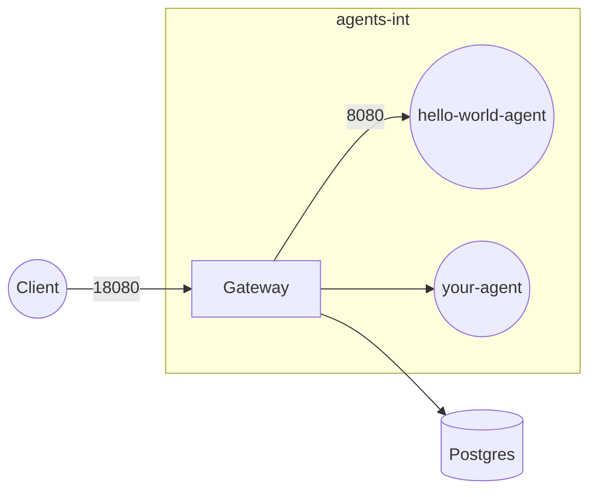

# Agent Control Plane

[](https://github.com/agentsystems/agent-control-plane/actions/workflows/ci.yml) [](https://codecov.io/gh/agentsystems/agent-control-plane)

The **Agent Control Plane** (ACP) is the HTTP gateway and core services layer that fronts every AgentSystems deployment.

* Repo: `agentsystems/agent-control-plane`
* Image: `agentsystems/agent-control-plane:<tag>`
* Part of the multi-repository platform – full picture in the [Mintlify docs](../docs/overview).

---

## Contents

| Path | Purpose |
|------|---------|
| `cmd/gateway/` | FastAPI gateway & reverse-proxy (modularized components) |
| ├── `main.py` | Core FastAPI application and endpoints |
| ├── `database.py` | PostgreSQL connection pooling and job management |
| ├── `docker_discovery.py` | Docker container discovery and agent registration |
| ├── `egress.py` | Egress allowlist configuration and management |
| ├── `lifecycle.py` | Container idle timeout and lifecycle management |
| ├── `proxy.py` | HTTP CONNECT proxy server for agent egress |
| ├── `models.py` | Pydantic data models |
| └── `exceptions.py` | Common HTTP exception patterns |
| `Dockerfile` | Container image build instructions |
| `tests/` | Unit tests for gateway functionality |
| `.coveragerc` | Test coverage configuration |
| `CHANGELOG.md` | Version history and changes |

---

## How ACP fits into the platform



1. Gateway discovers containers with labels `agent.enabled=true` & `agent.port=<port>`.
2. Auth (Bearer token placeholder) → forward to agent.
3. Writes an append-only **audit** row (hash-chained).

Endpoint details: [Gateway API](../docs/reference/gateway-api).

---

## Quick start (compose)

Use the deployment repo:

```bash
# clone side-by-side
mkdir agents && cd agents
for r in agent-control-plane agent-platform-deployments agent-template; do
  git clone https://github.com/agentsystems/$r.git
done

cd agent-platform-deployments
make up    # gateway + Postgres + hello-world-agent
```

• Swagger: <http://localhost:18080/hello-world-agent/docs>
• List agents & states: `curl http://localhost:18080/agents -H "Authorization: Bearer demo"`

---

## Local dev (hot reload)

```bash
cd agent-control-plane
python -m venv .venv && source .venv/bin/activate
pip install -r requirements-dev.txt
# override port via env if desired
ACP_BIND_PORT=8088 uvicorn cmd.gateway.main:app --reload --port ${ACP_BIND_PORT:-8080}
```

### Running tests

```bash
# Run all tests with coverage
pytest --cov=cmd --cov-report=term-missing

# Run specific test file
pytest tests/test_gateway.py -v
```

---

## Build & push container

```bash
# Pull the latest published image (recommended for most users)
docker pull agentsystems/agent-control-plane:latest

# OR build a local image for experimentation
git clone https://github.com/agentsystems/agent-control-plane.git
cd agent-control-plane
./build_and_release.sh --version dev           # local build, no push
```

If you built a custom image, update the tag in your Compose / Helm manifests (`agent-platform-deployments`).

---

## File Uploads & Artifacts

The gateway supports file uploads to agents and manages a shared artifacts volume.

### Upload Endpoint

Send multipart requests to any agent:

```bash
# Upload single file with JSON payload
curl -X POST http://localhost:18080/invoke/agent-name \
  -H "Authorization: Bearer token" \
  -F "file=@data.csv" \
  -F 'json={"sync": true, "format": "csv"}'

# Upload multiple files
curl -X POST http://localhost:18080/invoke/agent-name \
  -H "Authorization: Bearer token" \
  -F "file=@input1.txt" \
  -F "file=@input2.txt" \
  -F 'json={"sync": true}'
```

### Artifacts Volume Management

The gateway automatically:

1. **Creates thread directories**: `/artifacts/{thread-id}/{in,out}/` for each request
2. **Saves uploaded files**: Files go to `/artifacts/{thread-id}/in/{filename}`
3. **Sets permissions**: Ensures agents (UID 1001) can access files
4. **Enforces limits**: Default 200MB upload limit (configurable via `ACP_MAX_UPLOAD_MB`)

### Thread-Centric Structure

```
/artifacts/
├── {thread-id-1}/
│   ├── in/          # Files uploaded by client
│   │   ├── data.csv
│   │   └── config.json
│   └── out/         # Files created by agent
│       └── result.txt
└── {thread-id-2}/
    ├── in/
    └── out/
```

### Gateway Environment Variables

| Var | Default | Purpose |
|-----|---------|---------|
| `ACP_MAX_UPLOAD_MB` | `200` | Maximum file upload size in MB |
| `ACP_BIND_PORT` | `8080` | Gateway listen port inside container |
| `ACP_AUDIT_DSN` | `postgresql://...` | Postgres connection for audit logs |
| `ACP_PROXY_PORT` | `3128` | HTTP CONNECT proxy port for agent egress |
| `ACP_IDLE_TIMEOUT_MIN` | `15` | Default idle timeout for containers (minutes) |
| `AGENTSYSTEMS_CONFIG_PATH` | `/etc/agentsystems/agentsystems-config.yml` | Path to agent configuration file |

### Accessing Artifacts

View uploaded files and agent outputs:

```bash
# List all active threads
docker exec gateway ls -la /artifacts/

# Read specific files
docker exec gateway cat /artifacts/{thread-id}/out/result.json
```

---

## Configuration

## Continuous Integration (GitHub Actions)

Every pull request triggers `ci.yml` which now performs:

1. Pre-commit hooks (ruff, black, shellcheck, hadolint).
2. `docker build` of the gateway image.
3. Run the container on `localhost:8800` (internal port 8080).
4. Poll `http://localhost:8800/health` (30 × 2 s) and fail if not **200 OK**.
5. Always remove the container in a cleanup step.

The gateway detects when the host Docker socket is absent (e.g. CI) and gracefully disables agent discovery, emitting the log line `docker_unavailable`. The health endpoint still reports **OK**, so the build remains deterministic.

---

### Environment variables (excerpt)

| Var | Default | Purpose |
|-----|---------|---------|
| `PG_HOST` | `localhost` | Postgres host |
| `PG_DB` | `agent_cp` | Postgres database name |
| `PG_USER` | `agent` | Postgres user |
| `PG_PASSWORD` | `agent` | Postgres password |

### Agent discovery labels

| Label | Example | Meaning |
|-------|---------|---------|
| `agent.enabled` | `true` | Opt-in to gateway routing. |
| `agent.port` | `8000` | TCP port the agent listens on. |

---

## Architecture

### Module Structure

The gateway is organized into focused modules:

- **`main.py`**: FastAPI application, request routing, and API endpoints
- **`docker_discovery.py`**: Container discovery via Docker labels, maintains agent registry
- **`database.py`**: PostgreSQL operations with automatic fallback to in-memory storage
- **`egress.py`**: Loads and manages per-agent egress allowlists from config
- **`proxy.py`**: HTTP CONNECT proxy server for controlled agent outbound requests
- **`lifecycle.py`**: Monitors agent activity and stops idle containers
- **`models.py`**: Shared Pydantic models for request/response validation
- **`exceptions.py`**: Standardized HTTP exception factories

### Key Features

1. **Auto-discovery**: Finds agents by Docker labels (`agent.enabled=true`)
2. **Lazy start**: Automatically starts stopped agent containers on first request
3. **Idle management**: Stops containers after configurable idle timeout
4. **Egress control**: HTTP proxy restricts agent outbound requests to allowlisted URLs
5. **File uploads**: Handles multipart uploads with automatic artifact management
6. **Async by default**: Non-blocking invocations with status polling
7. **Type safety**: Full type hints for better IDE support and early error detection

## Contributing

See [CONTRIBUTING.md](CONTRIBUTING.md) for guidelines on contributing to this project.

### Development Guidelines

- Add type hints to all new functions
- Include docstrings for public APIs
- Update CHANGELOG.md for notable changes
- Run tests before submitting PRs: `pytest`

---

<!--
## Legacy README

**Agent Control Plane** (ACP) is the HTTP gateway and set of core micro-services that sit in front of every AgentSystems deployment.

* Repository root: `agentsystems/agent-control-plane`
* Container image: `agentsystems/agent-control-plane:<tag>`
* Part of the wider multi-repo platform – see the [docs site](../docs/overview) for the big picture.

This repository contains the **gateway runtime** and libraries that power the Agent Platform. It no longer carries any Docker-Compose assets – those now live in the separate [`agent-platform-deployments`](https://github.com/agentsystems/agent-platform-deployments) repository.


## Contents

| Path | Purpose |
|------|---------|
| `cmd/gateway/` | FastAPI HTTP gateway & reverse-proxy. |
| `audit/` | Postgres writer + hash-chain trigger (tamper-evident). |
| `model_router/` | (WIP) Policy-based model selection. |
| `examples/agents/` | Example agents generated from the [agent-template](https://github.com/agentsystems/agent-template). |
| - | - |
| `cmd/gateway/` | FastAPI gateway that discovers agent containers via Docker labels and proxies requests. |
| `model_router/` | (WIP) Simple model selection helper. |
| `audit/` | (Planned) Append-only Postgres audit writer. |
| `examples/agents/` | Minimal example agents built from the [agent-template](https://github.com/agentsystems/agent-template). |


## How ACP fits into the platform


1. **Gateway** discovers containers on the `agents-int` internal network via Docker/Kubernetes labels `agent.enabled=true` and `agent.port=<port>`.
2. Requests are authenticated (Bearer token placeholder for now) and forwarded to the agent container.
3. Each round-trip is appended to the **audit** table (hash-chained rows) and optionally mirrored to Langfuse.

See the [Gateway API reference](../docs/reference/gateway-api) for endpoints.

## Quick start (compose)

The fastest path is the deployment repo:

```bash
# clone side-by-side
mkdir agents && cd agents
for repo in agent-control-plane agent-platform-deployments agent-template; do
  git clone https://github.com/agentsystems/$repo.git
done

cd agent-platform-deployments
make up        # docker compose up -d (gateway + Postgres + example agent)
```

Browse:
• Gateway Swagger UI → <http://localhost:18080/hello-world-agent/docs>
• List agents & states → `curl http://localhost:18080/agents -H "Authorization: Bearer demo"`
  Returns JSON array of objects like `{ "name": "hello-world-agent", "state": "running" }`

## Local development (hot reload)

```bash
cd agent-control-plane
python -m venv .venv && source .venv/bin/activate
pip install -e .[dev]
# override port via env if desired
ACP_BIND_PORT=8088 uvicorn cmd.gateway.main:app --reload --port ${ACP_BIND_PORT:-8080}
```

Point the deployment’s compose file at `host.docker.internal:8080` or run an agent locally on port 8000 and the gateway will pick it up.

## Building the container


This repo is intended to be **built into a container image** and then orchestrated via the manifests in [`agent-platform-deployments`](https://github.com/agentsystems/agent-platform-deployments).

```
# clone
 git clone https://github.com/agentsystems/agent-control-plane.git
 cd agent-control-plane

# build image (adjust tag as needed)
 docker build -t agentsystems/agent-control-plane:<tag> .
```

Push the image to your registry of choice and update the image tag in the deployment repo’s Compose / Helm charts.


```
 && source .venv/bin/activate
pip install -e .[dev]
# override port via env if desired
ACP_BIND_PORT=8088 uvicorn cmd.gateway.main:app --port ${ACP_BIND_PORT:-8080}
```

But day-to-day you will spin it up via the deployment bundle, e.g.:

```
# in agent-platform-deployments

```

```
# clone
git clone https://github.com/agentsystems/agent-control-plane.git
cd agent-control-plane

# create venv & install
 && source .venv/bin/activate
pip install -e .[dev]

# run gateway
# override port via env if desired
ACP_BIND_PORT=8088 uvicorn cmd.gateway.main:app --reload --port ${ACP_BIND_PORT:-8080}
```

 (either with Docker or `uvicorn agent.main:app`) and the gateway will auto-register it if the container is labelled `agent.enabled=true` and exposes the port declared in `agent.port`.

 (gateway + Postgres + example agent, etc.) use the **agent-platform-deployments** repo:

```bash
# in a separate clone
cd agent-platform-deployments
docker compose -f compose/local/docker-compose.yml up -d
```


## Configuration & conventions

Environment variables (excerpt):

| Var | Default | Purpose |
|-----|---------|---------|
| `ACP_BIND_PORT` | `8080` | Gateway listen port inside the container. |
| `ACP_AUDIT_DSN` | `postgresql://user:pw@postgres:5432/acp` | Audit Postgres connection. |
| `ACP_ALLOWED_ORIGINS` | `*` | CORS origins. |

Agent discovery labels:

| Label | Example | Meaning |
|-------|---------|---------|
| `agent.enabled` | `true`  | Opt-in to gateway routing. |
| `agent.port`    | `8000`  | Container port to forward to. |

## Release checklist
1. Bump version in `pyproject.toml`.
2. Build & push Docker image: `docker build -t agentsystems/agent-control-plane:<tag> .`.
3. Create Git tag and release notes.
4. Update Compose / Helm charts in `agent-platform-deployments` with the new `<tag>`.


 © 2025 AgentSystems


 + (includes Compose v2)


          # repo root
docker compose build                  # build agents + gateway
docker compose up -d                  # start stack (detached)
curl http://localhost:18080/agents | jq .   # → `{ "agents": [ {"name": "hello-world-agent", "state": "running"}, ... ] }`
```

Swagger for any agent:
<http://localhost:18080/my_agent/docs>


Invoke an agent and poll status until it completes:

```bash
# 1. Start the job (returns thread_id and helper URLs)
resp=$(curl -s -X POST http://localhost:18080/invoke/my_agent \
     -H "Content-Type: application/json" \
     -d '{"today":"2025-06-13"}')
thread_id=$(echo "$resp" | jq -r .thread_id)

# 2. Poll lightweight status endpoint (state + progress only)
curl -s http://localhost:18080/status/$thread_id | jq .
# { "state": "running", "progress": { ... } }

# 3. Fetch the final result when state == completed
curl -s http://localhost:18080/result/$thread_id | jq .
# { "result": { ... } }
```


```bash
docker compose down        # stop containers, keep images
docker system prune -f     # optional: clear build cache
```


```bash
# copy an existing folder
cp -R my_agent my_fourth_agent

# edit YAML metadata
sed -i '' 's/name:.*/name: my_fourth_agent/' my_fourth_agent/agent.yaml

# (optional) tweak greeting
sed -i '' 's/Hello!/Howdy from agent four!/' my_fourth_agent/main.py
```

Append this to **docker-compose.yml**:

```yaml
my_fourth_agent:
  build: ./my_fourth_agent
  expose: ["8000"]
  labels:
    - agent.enabled=true
    - agent.port=8000
```

Then:

```bash
docker compose build my_fourth_agent
docker compose up -d my_fourth_agent
curl http://localhost:18080/agents | jq .   # shows `{ "name": "my_fourth_agent", "state": "running" }`
curl -X POST http://localhost:18080/invoke/my_fourth_agent \
     -H "Content-Type: application/json" \
     -d '{"today":"2025-06-13"}'
```


 + label discovery (`/gateway`)
Agents   → FastAPI apps in `my_*_agent/`, read their own `agent.yaml`
Labels   → `agent.enabled=true` & `agent.port=8000` tell the gateway to route
-->
