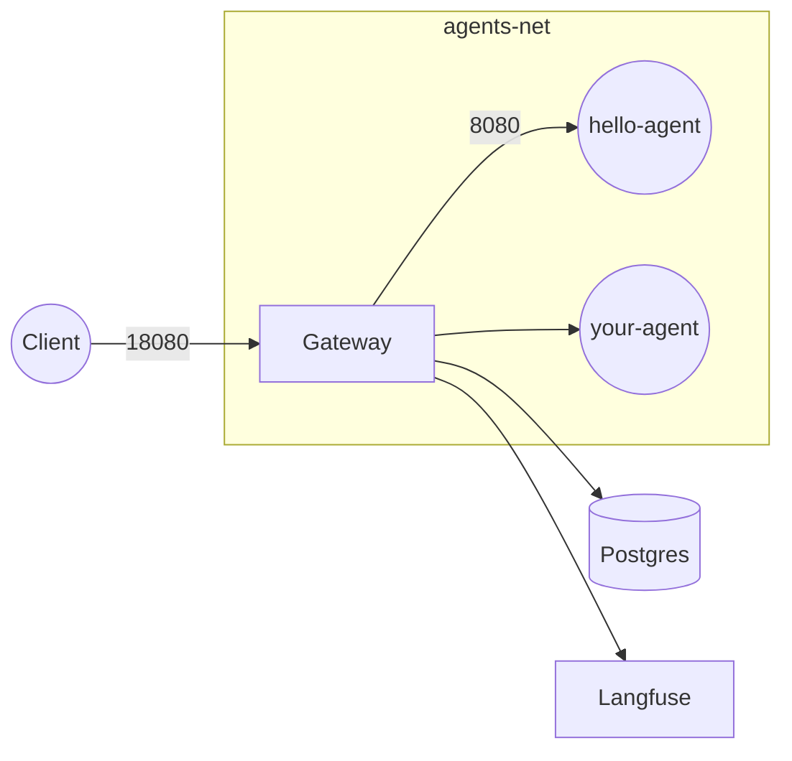
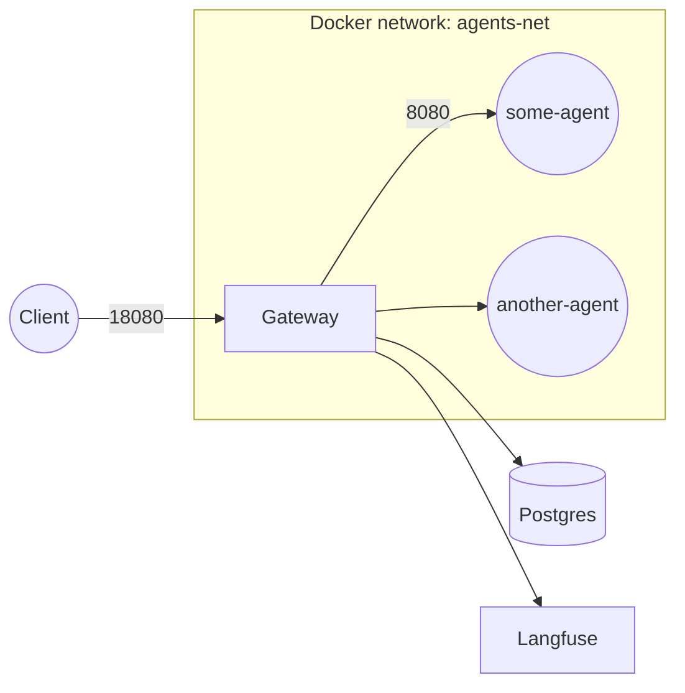

# Agent Control Plane

The **Agent Control Plane** (ACP) is the HTTP gateway and core services layer that fronts every Agent Systems deployment.

* Repo: `agentsystems/agent-control-plane`
* Image: `ghcr.io/agentsystems/agent-control-plane:<tag>`
* Part of the multi-repo platform – full picture in the [Mintlify docs](../docs/overview).

---

## Contents

| Path | Purpose |
|------|---------|
| `cmd/gateway/` | FastAPI gateway & reverse-proxy – discovers agents by Docker/K8s labels. |
| `audit/` | Postgres writer + hash-chain trigger (tamper-evident). |
| `model_router/` | (WIP) Policy-based LLM selection. |
| `examples/agents/` | Sample agents generated from the [agent-template](https://github.com/agentsystems/agent-template). |

---

## How ACP fits into the platform



1. Gateway discovers containers with labels `agent.enabled=true` & `agent.port=<port>`.
2. Auth (Bearer token placeholder) → forward to agent.
3. Writes an append-only **audit** row (hash-chained) and streams Langfuse traces.

Endpoint details: [Gateway API](../docs/reference/gateway-api).

---

## Quick start (compose)

Use the deployment repo:

```bash
# clone side-by-side
mkdir agents && cd agents
for r in agent-control-plane agent-platform-deployments agent-template; do
  git clone https://github.com/agentsystems/$r.git
done

cd agent-platform-deployments
make up    # gateway + Postgres + hello-agent
```

• Swagger: <http://localhost:18080/hello-agent/docs>  
• List agents: `curl http://localhost:18080/agents -H "Authorization: Bearer demo"`

---

## Local dev (hot reload)

```bash
cd agent-control-plane
python -m venv .venv && source .venv/bin/activate
pip install -e .[dev]
uvicorn cmd.gateway.main:app --reload --port 8080
```

---

## Build & push container

```bash
cd agent-control-plane
docker build -t ghcr.io/agentsystems/agent-control-plane:<tag> .
docker push ghcr.io/agentsystems/agent-control-plane:<tag>
```

Update the tag in Compose / Helm (`agent-platform-deployments`).

---

## Configuration

### Environment variables (excerpt)

| Var | Default | Purpose |
|-----|---------|---------|
| `ACP_BIND_PORT` | `8080` | Listen port inside container. |
| `ACP_AUDIT_DSN` | `postgresql://user:pw@postgres:5432/acp` | Audit Postgres DSN. |
| `ACP_ALLOWED_ORIGINS` | `*` | CORS origins. |

### Agent discovery labels

| Label | Example | Meaning |
|-------|---------|---------|
| `agent.enabled` | `true` | Opt-in to gateway routing. |
| `agent.port` | `8000` | TCP port the agent listens on. |

---

## Release checklist

1. Bump version in `pyproject.toml`.
2. `docker build -t ghcr.io/agentsystems/agent-control-plane:<tag> . && docker push …`.
3. Git tag & release notes.
4. Update Compose / Helm manifests with new tag.

---

## Legacy README

**Agent Control Plane** (ACP) is the HTTP gateway and set of core micro-services that sit in front of every Agent Systems deployment.

* Repository root: `agentsystems/agent-control-plane`
* Container image: `agentsystems/agent-control-plane:<tag>`
* Part of the wider multi-repo platform – see the [docs site](../docs/overview) for the big picture.

This repository contains the **gateway runtime** and libraries that power the Agent Platform. It no longer carries any Docker-Compose assets – those now live in the separate [`agent-platform-deployments`](https://github.com/agentsystems/agent-platform-deployments) repository.


## Contents

| Path | Purpose |
|------|---------|
| `cmd/gateway/` | FastAPI HTTP gateway & reverse-proxy. |
| `audit/` | Postgres writer + hash-chain trigger (tamper-evident). |
| `model_router/` | (WIP) Policy-based model selection. |
| `examples/agents/` | Example agents generated from the [agent-template](https://github.com/agentsystems/agent-template). |
| - | - |
| `cmd/gateway/` | FastAPI gateway that discovers agent containers via Docker labels and proxies requests. |
| `model_router/` | (WIP) Simple model selection helper. |
| `audit/` | (Planned) Append-only Postgres audit writer. |
| `examples/agents/` | Minimal example agents built from the [agent-template](https://github.com/agentsystems/agent-template). |


## How ACP fits into the platform



1. **Gateway** discovers containers on the `agents-net` network via Docker/Kubernetes labels `agent.enabled=true` and `agent.port=<port>`.
2. Requests are authenticated (Bearer token placeholder for now) and forwarded to the agent container.
3. Each round-trip is appended to the **audit** table (hash-chained rows) and optionally mirrored to Langfuse.

See the [Gateway API reference](../docs/reference/gateway-api) for endpoints.

## Quick start (compose)

The fastest path is the deployment repo:

```bash
# clone side-by-side
mkdir agents && cd agents
for repo in agent-control-plane agent-platform-deployments agent-template; do
  git clone https://github.com/agentsystems/$repo.git
done

cd agent-platform-deployments
make up        # docker compose up -d (gateway + Postgres + example agent)
```

Browse:  
• Gateway Swagger UI → <http://localhost:18080/hello-agent/docs>  
• List agents        → `curl http://localhost:18080/agents -H "Authorization: Bearer demo"`

## Local development (hot reload)

```bash
cd agent-control-plane
python -m venv .venv && source .venv/bin/activate
pip install -e .[dev]
uvicorn cmd.gateway.main:app --reload --port 8080
```

Point the deployment’s compose file at `host.docker.internal:8080` or run an agent locally on port 8000 and the gateway will pick it up.

## Building the container


This repo is intended to be **built into a container image** and then orchestrated via the manifests in [`agent-platform-deployments`](https://github.com/agentsystems/agent-platform-deployments).

```
# clone
 git clone https://github.com/agentsystems/agent-control-plane.git
 cd agent-control-plane

# build image (adjust tag as needed)
 docker build -t agentsystems/agent-control-plane:<tag> .
```

Push the image to your registry of choice and update the image tag in the deployment repo’s Compose / Helm charts.


```
 && source .venv/bin/activate
pip install -e .[dev]
uvicorn cmd.gateway.main:app --port 8080
```

But day-to-day you will spin it up via the deployment bundle, e.g.:

```
# in agent-platform-deployments

```

```
# clone
git clone https://github.com/agentsystems/agent-control-plane.git
cd agent-control-plane

# create venv & install
 && source .venv/bin/activate
pip install -e .[dev]

# run gateway
uvicorn cmd.gateway.main:app --reload --port 8080
```

 (either with Docker or `uvicorn agent.main:app`) and the gateway will auto-register it if the container is labelled `agent.enabled=true` and exposes the port declared in `agent.port`.

 (gateway + Postgres + example agent, etc.) use the **agent-platform-deployments** repo:

```bash
# in a separate clone
cd agent-platform-deployments
docker compose -f compose/local/docker-compose.yml up -d
```


## Configuration & conventions

Environment variables (excerpt):

| Var | Default | Purpose |
|-----|---------|---------|
| `ACP_BIND_PORT` | `8080` | Gateway listen port inside the container. |
| `ACP_AUDIT_DSN` | `postgresql://user:pw@postgres:5432/acp` | Audit Postgres connection. |
| `ACP_ALLOWED_ORIGINS` | `*` | CORS origins. |

Agent discovery labels:

| Label | Example | Meaning |
|-------|---------|---------|
| `agent.enabled` | `true`  | Opt-in to gateway routing. |
| `agent.port`    | `8000`  | Container port to forward to. |

## Release checklist
1. Bump version in `pyproject.toml`.
2. Build & push Docker image: `docker build -t agentsystems/agent-control-plane:<tag> .`.
3. Create Git tag and release notes.
4. Update Compose / Helm charts in `agent-platform-deployments` with the new `<tag>`.


 © 2025 Agent Systems


 + (includes Compose v2)


          # repo root
docker compose build                  # build agents + gateway
docker compose up -d                  # start stack (detached)
curl http://localhost:18080/agents     # → {"agents":[ ... ]}
```

Swagger for any agent:  
<http://localhost:18080/my_agent/docs>


```bash
curl -X POST http://localhost:18080/my_agent \
     -H "Content-Type: application/json" \
     -d '{"today":"2025-06-13"}'
```


```bash
docker compose down        # stop containers, keep images
docker system prune -f     # optional: clear build cache
```


```bash
# copy an existing folder
cp -R my_agent my_fourth_agent

# edit YAML metadata
sed -i '' 's/name:.*/name: my_fourth_agent/' my_fourth_agent/agent.yaml

# (optional) tweak greeting
sed -i '' 's/Hello!/Howdy from agent four!/' my_fourth_agent/main.py
```

Append this to **docker-compose.yml**:

```yaml
my_fourth_agent:
  build: ./my_fourth_agent
  expose: ["8000"]
  labels:
    - agent.enabled=true
    - agent.port=8000
```

Then:

```bash
docker compose build my_fourth_agent
docker compose up -d my_fourth_agent
curl http://localhost:18080/agents          # now lists my_fourth_agent
curl -X POST http://localhost:18080/my_fourth_agent \
     -H "Content-Type: application/json" \
     -d '{"today":"2025-06-13"}'
```


 + label discovery (`/gateway`)  
Agents   → FastAPI apps in `my_*_agent/`, read their own `agent.yaml`  
Labels   → `agent.enabled=true` & `agent.port=8000` tell the gateway to route
